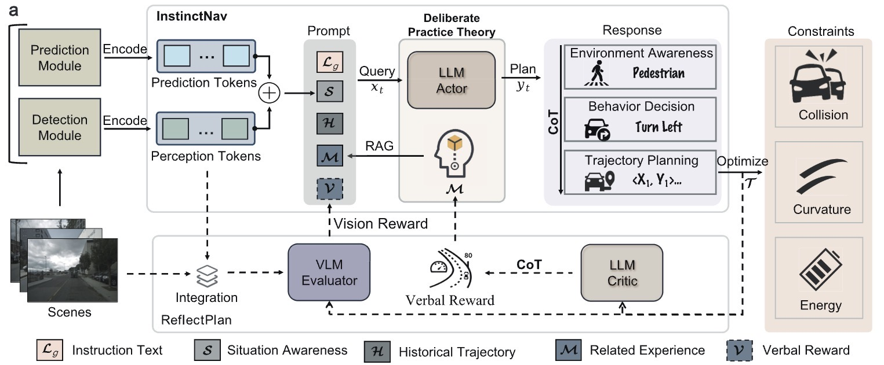

# CogniDriver: Autonomous Driving System based on Dual Process Theory and Deliberate Practice Theory


> Note: Running CogniDriver requires pretrained LLM and VLM.

## Introduction

> Autonomous driving (AD), despite significant progress, is still not widely applied in open, unconstrained environments, primarily owing to deficiencies in hazard perception, few-shot generalization, corner case generalization, and evaluation metrics, resulting in reliability concerns. To address these challenges, we propose CogniDrive, an innovative framework based on dual-process and deliberate practice theories, leveraging contextual reasoning of the Large Language Model (LLM) to enhance AD robustness and generalization. Inspired by dual-process theory, CogniDrive comprises two cognition modes: InstinctNav for rapid, intuitive decision-making and ReflectPlan for reflective reasoning. Enhanced by a thought model and experience embedding for LLM, InstinctNav combines behavioral cloning and retrieval augmented generation to enhance few-shot learning efficiency based on deliberate practice theory. ReflectPlan processes and internalizes reward signals embedded in language tokens within the prompt, derived from a self-reflection mechanism, to enable continuous improvement and generalization. To detect hazards in corner cases precluded by limited training data distribution, a vision language model is integrated for comprehensive environmental understanding through multimodal self-reflection. Furthermore, we propose an evaluation system that addresses the incompleteness of traditional metrics and emphasizes safety, comfort, and energy efficiency. {\color{blue}CogniDrive has been extensively evaluated in both open-loop and closed-loop settings. On the nuScenes, Waymo Open Motion, and CODA datasets, it consistently achieves strong open-loop performance, while closed-loop tests in the CARLA simulator further confirm its robustness and adaptability.




https://github.com/user-attachments/assets/2003e062-2b08-48e4-a608-8adf2eed4446


## Installation
a. Install the dependent libraries as follows:

```bash
cd CogniDriver/driver
pip install -r requirements.txt 
```

## Data Preparation
a. Ensure that the data types are complete:

```bash
CogniDriver/driver
├── data
│   ├── cached_nuscenes_info.pkl
│   ├── reflection.json
│   ├── split.json
│   ├── train_data_mixatral.jsonl
│   ├── val_data_mixatral.jsonl
├── eval_share
├── inference
├── models
├── output
├── tools
├── train
```

## Fine-Tuning via Two-Stage Fine-tuning
a. Format Learning 

```bash
python -m driver.train.SFT \
  --model_path  HuggingFaceTB/SmolLM2-360M-Instruct \ 
  --train_dataset ../data/train_data_mixatral.jsonl \
  --val_dataset ../data/val_data_mixatral.jsonl \
  --streaming --num_train_epochs 5 \
  --seq_length 1024 \
  --batch_size 8   \
  --learning_rate 1e-4  \
  --bf16 --gradient_checkpointing \
  --num_workers 24 \
  --output_dir ../outputs/sft_checkpoint
```
> Note: For the convenience of reproduction, and for this step we have relied on SFT, you can directly use the Swift framework.

```
pip install ms-swift
```

```bash
NPROC_PER_NODE=8  MASTER_PORT=29500 swift sft \
  --model HuggingFaceTB/SmolLM2-360M-Instruct  \
  --dataset ../data/train_data_mixatral.jsonl  \
  --val_dataset ../data/val_data_mixatral.jsonl  \
  --train_type full  \
  --torch_dtype bfloat16 \
  --num_train_epochs 5  \
  --per_device_train_batch_size 8 \
  --per_device_eval_batch_size 8 \
  --learning_rate 5e-5  \
  --eval_steps 200     \
  --save_steps 100  \
  --logging_steps 5  \
  --max_length 8192 \
  --warmup_ratio 0.1 \
  --dataloader_num_workers 8     \
  --save_total_limit 2    \
  --output_dir ../outputs/sft_checkpoint \
  --attn_impl flash_attn   \
  --target_modules all-linear  \
  --gradient_checkpointing_kwargs '{"use_reentrant": false}' \
  --neftune_noise_alpha 10 \
  --use_liger_kernel true  

```


b. Value Learning

```bash
python -m driver.train.PPO \
  --model_path  HuggingFaceTB/SmolLM2-360M-Instruct \ 
  --train_dataset ../data/train_data_mixatral.jsonl \
  --val_dataset ../data/val_data_mixatral.jsonl \
  --streaming --num_train_epochs 5 \
  --seq_length 1024 \
  --batch_size 8   \
  --learning_rate 1e-4  \
  --bf16 --gradient_checkpointing \
  --num_workers 24 \
  --output_dir ../outputs/ppo_checkpoint
```

## Inference

```bash
CUDA_VISIBLE_DEVICES=0,1 python -m driver.inference.agent_driver \
  --lora $LORA_PATH \
  --llm_model_path $MODEL_PATH \ 
  --vlm_model_path $CKPT_PATH
  --output $OUTPUT_NAME
```

## Evaluation
> Note: Replace the .pkl path in **evaluation.py** for your **$OUTPUT_NAME**. 
```
cd eval_share
python evaluatation.py
```

## CARLA Closed-Testing (Bench2Drive)
>Refer to: https://github.com/Thinklab-SJTU/Bench2Drive/tree/main?tab=readme-ov-file
### Installation

```bash
# STEP 1. Clone Bench2Drive repository
git clone https://github.com/Thinklab-SJTU/Bench2Drive/tree/main
cd Bench2Drive
```

```bash
# STEP 2. Create and activate conda environment
conda create -n bench2drive python=3.8 -y
conda activate bench2drive
conda install -c "nvidia/label/cuda-11.8.0" cuda-toolkit
pip install torch torchvision torchaudio --index-url https://download.pytorch.org/whl/cu118
```

```bash
# STEP 3. Install dependencies
# cuda 11.8 and GCC 9.4 is strongly recommended. Otherwise, it might encounter errors.
export PATH=YOUR_GCC_PATH/bin:$PATH
export CUDA_HOME=YOUR_CUDA_PATH/
pip install ninja packaging
pip install -v -e .
```

```bash
#STEP 4. Prepare pretrained UniAD weights. create directory ckpts
mkdir ckpts 
```
> Download resnet50-19c8e357.pth form [Hugging Face](https://huggingface.co/rethinklab/Bench2DriveZoo/blob/main/resnet50-19c8e357.pth). \
> Download r101_dcn_fcos3d_pretrain.pth form [Hugging Face](https://huggingface.co/rethinklab/Bench2DriveZoo/blob/main/r101_dcn_fcos3d_pretrain.pth). \
> Download uniad_base_b2d.pth form [Hugging Face](https://huggingface.co/rethinklab/Bench2DriveZoo/blob/main/uniad_base_b2d.pth).

```bash
# STEP 4. Install CARLA (>=0.9.13 recommended)
mkdir carla
cd carla
wget https://carla-releases.s3.us-east-005.backblazeb2.com/Linux/CARLA_0.9.15.tar.gz
tar -xvf CARLA_0.9.15.tar.gz
cd Import && wget https://carla-releases.s3.us-east-005.backblazeb2.com/Linux/AdditionalMaps_0.9.15.tar.gz
cd .. && bash ImportAssets.sh
export CARLA_ROOT=YOUR_CARLA_PATH

echo "$CARLA_ROOT/PythonAPI/carla/dist/carla-0.9.15-py3.7-linux-x86_64.egg" >> YOUR_CONDA_PATH/envs/YOUR_CONDA_ENV_NAME/lib/python3.8/site-packages/carla.pth 
```

### Inference Setting
>Encapsulate the reasoning process into an api via **flask**. (The Qwen2.5 series models need to be prepared.)
```bash
CUDA_VISIBLE_DEVICES=0,1 python server.py \
  --llm_model_path $$LLM_PATH \
  --lora $LORA_PATH \
  --vlm_model_path  $VLM_PATH \
  --enable_nuscenes \
  --port 5000\
  --debug
```
### Set end2end config
```bash
cd Bench2Drive/leaderboard
mkdir team_code
cd ..
ln -s Bench2DriveZoo  ./                   
```
>Go to the parent directories of CogniDrive and Bench2Drive

```bash
mkdir Bench2Drive/config
cd Bench2Drive/config
ln -sfn ../../CogniDrive/config/e2e_config.py .
ln -sfn ../../CogniDrive/config/prompt_message.py .
cd ../leaderboard/scripts
ln -sfn ../../../CogniDrive/config/run_evaluation.sh .
cd ../team_code
ln -sfn ../../../CogniDrive/drive/e2e_carla.py .
```

### Evaluation
```bash
bash leaderboard/scripts/run_evaluation.sh
```

